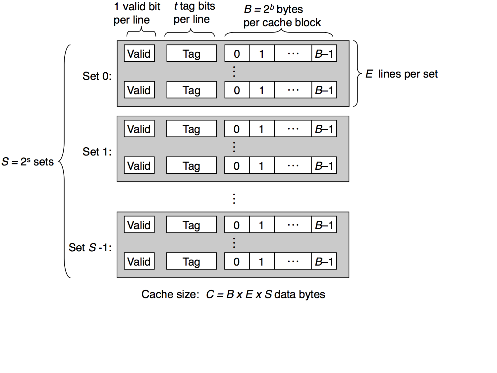

# Cache Organization

There is no code for this activity. It is simply an investigation into how the
bits for an address get set up to access a byte in cache. Work out the numbers
needed for each cache and keep track of them in a new text file,
`responses.txt`.

Work with a partner on the following questions.

Be sure to double-check your work, since it is easy to make small mistakes that
can propagate.

--------------

All caches follow this general structure as shown in your book in Figure 6.25:

--------------

A full address to memory must have these elements:

Suppose that we want to determine what the address is for the following real
processor. A specification can be found here:

[Intel® Xeon® Processor E5-2697 v4 Specifications](http://www.cpu-world.com/CPUs/Xeon/Intel-Xeon%20E5-2697%20v4.html)

## Main Memory and Chip Design

It is interesting to note how current processors have been designed for main
memory values that are absurdly unattainable today. For the Xeon processor
linked above:

0. What is the maximum value of the size of main memory, M?

## Enterprise servers can have a lot of memory

Companies like Hewlett Packard can configure servers with very large amounts of
memory, such as 1024 Gigabytes (GB). To address each byte of that memory using
cache-based addresses, we need to determine what the structure of a cache
address would be. 

For each of the questions below, begin by stating what the cache size C is, and
what the number of lines per set E is. Then use those to determine S, t, s, and
b.

1. For one of the the level 1 caches, per processor, what would the values for
the t bits, the s bits, and the b bits be if 1024 GB of memory was installed on
the machine?

2. For the level 2 cache, what would the values for the t bits, the s bits, and the b bits be if 1024 GB of memory was installed on the machine?
